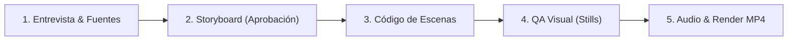

# video-pizarra (Antigravity Edition)

Convierte cualquier tema en un video animado de ~60–75 s que se siente dibujado a mano: una mascota que actúa, frases escritas en vivo, cada escena con su propio fondo y herramienta, transiciones conectadas al ritmo de la música y efectos de sonido procedurales.

Todo el motor ya está programado en `template/` (Pizarrón GSAP+SVG) y `template-estilos/` (Canvas multi-estilo). Tu trabajo es **entender bien el video que el usuario quiere**, diseñar un guión/storyboard de alta retención y construir las escenas con el API del motor.

---

## 1. Opciones y Personalización Total

| Elemento | Pizarrón (`template/`) | Estilos (`template-estilos/`) |
|---|---|---|
| **Colores de marca** | `palette` y `hatches` en la configuración | `palette: { accent: '#hex', bg: '#hex' }` |
| **Tipografía** | Fuentes en `references/engine-api.md` | `font: { display: 'Bebas Neue', body: 'Poppins' }` (Google Fonts) |
| **Mascota o personaje** | `mascotShape` o `image()` con PNG | `mascot: 'clawd' \| 'bot' \| 'blob'` o PNG personalizado |
| **Salir el usuario (A-Roll)** | — | `person: { photo }` (`cutout.py foto.jpg`) o cámara real (`componer.ps1` / `componer.sh`) |
| **Imágenes, logos, capturas** | `image()` | Escenas `media`, `sticker`, `shotCard` |
| **Formato / Duración** | 9:16 vertical o 16:9 horizontal | 9:16 o 16:9, cualquier duración |
| **Audio / Voz / Música** | `audio/vo.wav`, `audio/music.mp3`, Suno AI | Igual; mezcla automática con loudnorm -14 LUFS |
| **Idioma** | Cualquier idioma en textos y `say` | Igual |

### Catálogo de Estilos (`template-estilos/`)
1. **Acuarela**: Textura de papel rugoso y tinta líquida que hierve.
2. **Acuarela viva**: Contraste alto con detalles en naranja/rojo/negro y mascota destacada.
3. **Cuaderno**: Estilo *bullet journal* con efecto de resaltador/marcatextos.
4. **Minimal**: Fondo blanco premium, limpio y editorial.

---

## 2. Flujo de Trabajo en Antigravity



### Paso 1 · Entrevista Inicial
Si el usuario ya dio detalles específicos en su mensaje, adopta defaults inteligentes para lo que falte y confirma. Si es una petición abierta, usa `ask_question` o haz preguntas directas y concisas sobre:
1. **Tema y mensaje central**: La única idea que el espectador debe recordar + fuentes/datos clave.
2. **Formato y duración**: 9:16 (Shorts/Reels/TikTok) o 16:9 (YouTube). Duración objetivo (45s, 60s, 75s).
3. **Estilo visual**: Pizarrón clásico o uno de los 4 estilos alternativos.
4. **Mascota / Protagonista**: Mascota estándar, logo/dibujo propio, o sin personaje.
5. **Música y voz**: Con música generada (Suno), mp3 propio o solo SFX.

### Paso 2 · Investigación y Storyboard
- Si el tema incluye datos o noticias, verifica fuentes reales. **No inventes cifras derivadas**.
- Presenta el Storyboard al usuario (puedes usar una tabla markdown o un artefacto):
  - **Escena | Fondo | Herramienta | Texto en pantalla | Acción de la mascota | Transición**
- **Regla de retención**:
  - *Hook* en el primer segundo (< 0.5s).
  - El texto explica el concepto clave; la animación lo apoya de forma dinámica.
  - Una idea por escena con transiciones variadas (0.4–0.8s) y motivadas.

### Paso 3 · Inicializar el Proyecto y Construir
Para iniciar un nuevo video en un directorio de trabajo (ej. en `$HOME\.gemini\antigravity\scratch\<slug-video>` o el workspace activo):

**Para Pizarrón Clásico:**
```powershell
# En PowerShell (Windows):
$PROJ = "$HOME\.gemini\antigravity\scratch\<slug-video>"
New-Item -ItemType Directory -Path "$PROJ\audio" -Force
Copy-Item -Path "$HOME\.gemini\config\skills\video-pizarra\template\*" -Destination $PROJ -Recurse -Force
Set-Location $PROJ
npm install
Copy-Item scenes.example.js scenes.js
```

**Para Motor de Estilos (Acuarela, Cuaderno, Minimal):**
```powershell
$PROJ = "$HOME\.gemini\antigravity\scratch\<slug-video>"
New-Item -ItemType Directory -Path "$PROJ\audio" -Force
Copy-Item -Path "$HOME\.gemini\config\skills\video-pizarra\template-estilos\*" -Destination $PROJ -Recurse -Force
Set-Location $PROJ
npm install
```

> [!TIP]
> Consulta [`references/engine-api.md`](./references/engine-api.md) para el API del pizarrón clásico o [`references/guion-estilos.md`](./references/guion-estilos.md) para el motor de estilos. Revisa también [`references/errores.md`](./references/errores.md) y [`references/lessons.md`](./references/lessons.md).

### Paso 4 · QA Visual Obligatorio
Antes de compilar el video completo, genera capturas de fotogramas clave para verificar que no haya textos cortados, superposiciones o elementos fuera de cuadro:

```powershell
# Para Pizarrón:
node render.mjs --every 1.2
python contact.py 10

# Para Motor de Estilos:
node render.mjs --scenes
```
Usa la herramienta `view_file` sobre las imágenes generadas en `stills/` o `contact.jpg` para revisar la composición y legibilidad.

### Paso 5 · Generación de Audio y Render Final (100% Open Source / GPU)

El skill incluye integración directa con servidor GPU multimedia (o fallback local) mediante `scripts/audio_client.py`:

1. **Voz en Off (Locución)**:
   * **Opción A: Voz rápida neutra (< 2 segundos)**:
     ```powershell
     python scripts/audio_client.py tts-fast "Tu guión completo aquí..." audio/vo.wav --voice es-MX-DaliaNeural
     ```
     *Genera el audio en `audio/vo.wav` y las marcas de tiempo exactas por palabra en `audio/words.json`.*
   * **Opción B: Clonar tu propia voz (XTTS-v2 en la RTX 5070 Ti)**:
     ```powershell
     python scripts/audio_client.py tts-clone "Tu guión completo aquí..." audio/vo.wav --ref assets/tu_voz_referencia.wav
     ```
     *Usa un clip de 5-10s de tu voz y genera la locución clonada + `audio/words.json` con Faster-Whisper en GPU.*

2. **Música Original por IA**:
   ```powershell
   python scripts/audio_client.py music "lofi chill beat with rhodes piano, 105 bpm" 60.0 audio/music.mp3 --bpm 105
   ```
   *Genera una pista instrumental de 44.1 kHz sincronizada al tempo de tu video.*

3. **Sincronización Rítmica de Cortes (`beats.py`)**:
   ```powershell
   python beats.py audio/music.mp3
   ```
   *Extrae los beats a `audio/beats.json` para que las transiciones caigan en los golpes fuertes.*

4. **Compilación final**:
   ```powershell
   .\build.ps1 mi-video
   ```
   *(En Linux/macOS: `./build.sh mi-video`)*
   * Masteriza el video a **-14 LUFS**, aplica sidechain ducking (la música baja cuando habla la voz), sintetiza los efectos de sonido y genera `mi-video.mp4` y `mi-video-movil.mp4` (<30 MB).*

5. **Modo A-Roll (Persona a cámara + B-Roll animado)**:
   ```powershell
   .\componer.ps1 -ARoll aroll.mp4 -Name mi-video-final
   ```

---

## 3. Guía Rápida de Referencias

- [`references/engine-api.md`](./references/engine-api.md): Documentación del API de GSAP, textos manuscritos, stamps, transiciones y cámaras.
- [`references/guion-estilos.md`](./references/guion-estilos.md): Sintaxis de escenas (`hook`, `statement`, `list`, `stat`, `quote`, `compare`, `steps`, `cta`) para el motor canvas.
- [`references/historia.md`](./references/historia.md): Guía de ritmo, continuidad visual y composiciones avanzadas.
- [`references/storytelling.md`](./references/storytelling.md): Estructuras de guión de alta retención para redes sociales.
- [`references/lessons.md`](./references/lessons.md): Soluciones a errores visuales comunes (textos encimados, parpadeos, transforms).
